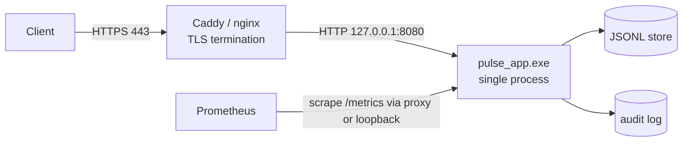

<!-- Copyright (c) 2026 Eleftherios Notas and The XIOM Authors -->
<!-- SPDX-License-Identifier: MIT OR Apache-2.0 -->
# XIOM PULSE -- Deployment Guide (proxy-first, TLS at the edge)

**Decision (Step 4):** in-XIOM TLS is **not** on the critical path. PULSE
speaks plaintext HTTP/1.1 on loopback; a front proxy (Caddy or nginx)
terminates TLS and forwards. This is the documented production shape until
the toolchain/stdlib grow a reviewed TLS stack.



## 1. Environment

| Variable | Default | Meaning |
|---|---|---|
| `PULSE_PORT` | `8080` | listen port |
| `PULSE_BIND` | `127.0.0.1` | listen address (loopback by design) |
| `PULSE_LOG` | `1` | `0` disables access-log lines |
| `PULSE_STORE_BACKEND` | `jsonl` | event store backend: `jsonl` or `kv` |
| `PULSE_STORE_PATH` | `pulse-events.jsonl` | JSONL event store |
| `PULSE_KV_DIR` | `pulse-kv` | kv segment directory (`kv` backend) |
| `PULSE_KV_PREFIX` | `evt-` | kv sequence-key prefix |
| `PULSE_AUDIT_PATH` | `pulse-audit.log` | audit trail |
| `PULSE_AUDIT_MAX_BYTES` | `5000000` | audit rotation threshold (`0` = off) |
| `PULSE_CONFIG` | (unset) | JSON config file (env wins) |
| `PULSE_ICON_PATH` | `resources/img/pulse-ico.ico` | `/favicon.ico` source |
| `PULSE_ASSETS_DIR` | `resources/public` | `/assets/*` showcase root |
| `PULSE_LANDING_PATH` | (unset) | HTML file served at `/` |
| `PULSE_JWT_SECRET` | dev default | **set in production** (HS256) |
| `PULSE_SESSION_TTL` | `3600` | session seconds |
| `PULSE_RATE_LIMIT` | `0` | global req/s cap; `0` = off |
| `PULSE_RATE_BURST` | = limit | token-bucket capacity |
| `PULSE_CSRF` | `1` | `0` disables CSRF checks |
| `PULSE_CORS_ORIGIN` | (unset) | opt-in CORS allowlist (comma-separated; `*` = any) |

Invalid values warn at startup and in `--check-config` (they fall back to
the defaults above).

Run: `out/pulse_app` (Linux) or `out\pulse_app.exe` (Windows); rebuild
with `scripts/build.sh src/server.xi --name pulse_app` (Linux) or
`.\scripts\build.ps1 src\server.xi -Name pulse_app` (Windows).

## 2. Caddy (recommended)

```caddyfile
pulse.example.com {
    encode zstd gzip
    header {
        Strict-Transport-Security "max-age=31536000; includeSubDomains"
        -Server
    }
    # PULSE has no recv timeouts yet (stdlib queued): enforce them here.
    reverse_proxy 127.0.0.1:8080 {
        transport http {
            dial_timeout 2s
            read_timeout 10s
            write_timeout 10s
        }
        health_uri /health
        health_interval 10s
    }
    @metrics path /metrics
    handle @metrics {
        # restrict scraping to the monitoring network
        @local remote_ip 127.0.0.1/32 10.0.0.0/8
        respond @local 403
        reverse_proxy 127.0.0.1:8080
    }
}
```

## 3. nginx (alternative)

```nginx
server {
    listen 443 ssl;
    server_name pulse.example.com;
    ssl_certificate     /etc/letsencrypt/live/pulse.example.com/fullchain.pem;
    ssl_certificate_key /etc/letsencrypt/live/pulse.example.com/privkey.pem;

    add_header Strict-Transport-Security "max-age=31536000; includeSubDomains" always;
    server_tokens off;

    location / {
        proxy_pass http://127.0.0.1:8080;
        proxy_http_version 1.1;
        proxy_set_header Connection close;   # PULSE is Connection: close today
        proxy_set_header X-Forwarded-For $remote_addr;
        proxy_read_timeout 10s;              # app-level timeouts pending
        proxy_send_timeout 10s;
    }
    location /metrics {
        allow 10.0.0.0/8; deny all;
        proxy_pass http://127.0.0.1:8080;
    }
}
```

**Important:** until stdlib recv timeouts land, the proxy MUST enforce read
timeouts -- a half-open request can hold PULSE's single-threaded loop.

## 4. Service supervision

**Windows (NSSM or Task Scheduler):**
```powershell
# Task Scheduler action, run at startup, restart on failure:
#   Program:   powershell.exe
#   Arguments: -NoProfile -ExecutionPolicy Bypass -File C:\pulse\run.ps1
# run.ps1 dot-sources scripts\dev-env.ps1 (toolchain not needed at runtime),
# sets the env vars above, and execs the built exe, restarting on exit.
```

**Linux (systemd):** unit with `Restart=always`,
`EnvironmentFile=/etc/pulse.env`, `ExecStart=/opt/pulse/pulse_app`,
`NoNewPrivileges=true`. Until C-PULSE-14 (Linux RSS growth, see
`docs/PROGRESS.md`) is fixed, add `MemoryMax=` and an RSS alert; the
restart policy keeps the process fresh.

## 5. Data, backup, retention

- `pulse-events.jsonl` (default backend): append-only; copy it for
  backup (a torn trailing line is tolerated on reopen; the next append
  heals the newline).
- `kv` backend (`PULSE_STORE_BACKEND=kv`): segment files under
  `PULSE_KV_DIR` (`evt-seg-*.kv`); native compaction keeps a single
  segment; sequence keys are `PULSE_KV_PREFIX` + counter.
- `pulse-audit.log`: append-only audit of mutating requests; rotates
  itself at `PULSE_AUDIT_MAX_BYTES` (`.1` kept).
- Snapshots: `scripts/backup.sh [--kv-dir DIR]` /
  `scripts/backup.ps1 [-KvDir DIR]` copy the store (file or kv dir) +
  audit into `backups/<UTC>/` with sizes + sha256 (`MANIFEST.txt`) and
  prune to `--keep`. With `PULSE_STORE_BACKEND=kv` the kv dir defaults
  to `$PULSE_KV_DIR`/`pulse-kv` automatically. For kv, compact first
  (`POST /api/events/compact`) so the snapshot is a single segment, then
  restore by stopping the service and copying `kv-store/` back over
  `PULSE_KV_DIR` and verifying `GET /api/events/count`.

## 6. Health, metrics, verification

```bash
curl -s https://pulse.example.com/health                 # {"status":"ok"}
curl -s https://pulse.example.com/api/version            # name/version
curl -s https://pulse.example.com/metrics | head         # Prometheus text
```

Through-proxy verification checklist:
1. TLS handshake + HSTS header present.
2. `/health` 200 via HTTPS; direct loopback probe 200.
3. `/metrics` blocked from the public path, allowed from the monitoring net.
4. Rate limit behaves: `PULSE_RATE_LIMIT=2` -> burst shows `429` +
   `Retry-After` (see `scripts\rate_smoke.ps1` for the pattern).
5. Kill the app; proxy health check flips unhealthy; supervisor restarts it
   (process supervision is external until PULSE grows signal handling).

## 7. Known gaps that affect deployment

- No in-app timeouts, keep-alive, or graceful signal drain (proxy +
  supervisor compensate).
- Sessions are in-memory (restart logs users out); secret rotation and
  session persistence are roadmap items (see `docs/PROGRESS.md`).
- `/metrics` has no auth of its own -- restrict at the proxy.

## 8. Linux deployment (verified 2026-10-07)

The Linux lane is real: the same v0.64.0 toolchain builds a native Linux
ELF (`scripts/build.sh src/server.xi --name pulse_app`), and the whole
fleet is green (suites x2, smoke 61/61, crash 6/6, store soak, and
`scripts/proxy_e2e.sh` 11/11 through nginx 1.24 TLS).

1. **Build:** install the Unix toolchain -- canonical source per the ops
   lane: `https://dl.xiom-lang.org/releases/<tag>/` (`SHA256SUMS` +
   `xiom-<ver>-linux-x64.tar.gz`; v0.64.0 published 2026-10-05; archive
   root `bin/` + `lib/`, verify with `sha256sum -c`), or the canonical
   layout `~/.local/share/xiom` on a dev box. Install the registry deps
   (`xiom pkg install xiom.http@0.1.1 xiom.cookie@0.1.1
   xiom.jwt@0.2.0 xiom.router@0.1.0 xiom.rate@0.2.0
   xiom.metrics@0.2.0 xiom.http.middleware@0.1.0 xiom.static@0.1.0`),
   then `. scripts/dev-env.sh && scripts/build.sh src/server.xi --name
   pulse_app`.
2. **Verify:** `scripts/http_smoke.sh --server-exe out/pulse_app
   --port 18093`, then the TLS path `scripts/proxy_e2e.sh
   --nginx-path <nginx>` (distro nginx needs the five
   `*_temp_path` directives from the script's generated config when
   running unprivileged).
3. **Supervise:** systemd unit with `Restart=on-failure`; env file as in
   section 4 (`X-Pulse-Quit` is test-only; production restarts are
   supervisor-driven).
4. **Docker (benchmark harness / staging rehearsal):** `deploy/Dockerfile`
   packages the Linux binary on ubuntu:24.04 (glibc match) with
   `PULSE_BIND=0.0.0.0` inside the container network:
   `docker build -f deploy/Dockerfile -t xiom-pulse:local .` then
   `docker run --rm -p 8080:8080 xiom-pulse:local` (verified:
   health/version/assets served from the container). On a Linux host this
   mirrors the VPS composition; Docker Desktop on Windows isolates
   containers in their own network namespace, so keep both sides in
   containers when rehearsing there. Host deployments keep the default
   `PULSE_BIND=127.0.0.1` (proxy-only exposure).
   **Showcase sites:** one binary serves any number of sites via env --
   `PULSE_ASSETS_DIR` (served under `/assets/`) and `PULSE_LANDING_PATH`
   (HTML at `/`); run one process (or container) per subdomain.
5. All scripts ship as `.ps1` and `.sh` twins; the shell twins are
   verified from WSL/Linux and enforced LF via `.gitattributes`.

## 9. Release artifacts and backups (local tooling, 2026-10-08)

- **Release packaging:** `scripts/release.ps1` / `scripts/release.sh`
  build and stage `dist/pulse-<ver>-<os>-<arch>.zip` (+ `.sha256`)
  containing the binary, `resources/img/pulse-ico.ico`, `README.md`,
  `LICENSE-*`, `NOTICE` -- the ops artifact convention. Version defaults
  to `src/pulse.xi`. Both artifacts verified locally (checksum matches,
  contents listed in the script output).
- **Backups:** `scripts/backup.ps1` / `scripts/backup.sh` snapshot the
  event store and the audit log (plus its `.1` rotation) into
  `backups/<UTC timestamp>/` with `MANIFEST.txt` (sizes + sha256), and
  prune to the newest `--keep` (default 7) snapshots. Missing sources are
  noted, not fatal. With the kv backend, pass `--kv-dir`/`-KvDir` (or
  set `PULSE_STORE_BACKEND=kv` and it picks `$PULSE_KV_DIR` up): the
  segment directory is copied to `kv-store/` and hashed file-by-file.
- **Restore procedure:** stop the service; copy the snapshot's
  `store.jsonl` over `PULSE_STORE_PATH` (or `kv-store/` over
  `PULSE_KV_DIR`, after compacting before the snapshot) and `audit.log`
  over `PULSE_AUDIT_PATH` if the audit trail matters; start the service;
  verify with `GET /api/events/count` against the pre-backup count. The
  JSONL store tolerates a torn tail, so restoring a slightly-live file is
  safe.
- **Pre-flight:** `pulse_app --check-config` dumps the effective config
  (env wins) without binding -- suitable as a deploy gate or systemd
  `ExecStartPre`; it exits non-zero only when the configured file is
  unreadable and flags the dev-default JWT secret (set `PULSE_JWT_SECRET`
  in the unit's env file).
