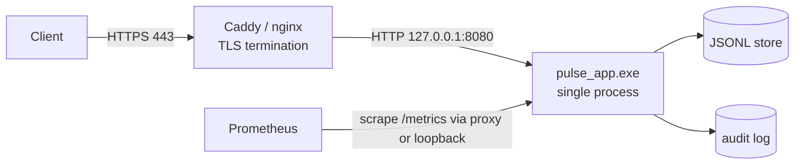

<!-- Copyright (c) 2026 Eleftherios Notas and The XIOM Authors -->
<!-- SPDX-License-Identifier: MIT OR Apache-2.0 -->
# XIOM PULSE -- Deployment Guide (proxy-first, TLS at the edge)

**Decision (Step 4):** in-XIOM TLS is **not** on the critical path. PULSE
speaks plaintext HTTP/1.1 on loopback; a front proxy (Caddy or nginx)
terminates TLS and forwards. This is the documented production shape until
the toolchain/stdlib grow a reviewed TLS stack.



## 1. Environment

| Variable | Default | Meaning |
|---|---|---|
| `PULSE_PORT` | `8080` | listen port (loopback) |
| `PULSE_LOG` | `1` | `0` disables access-log lines |
| `PULSE_STORE_PATH` | `pulse-events.jsonl` | event store |
| `PULSE_AUDIT_PATH` | `pulse-audit.log` | audit trail |
| `PULSE_ICON_PATH` | `resources/img/pulse-ico.ico` | `/favicon.ico` source |
| `PULSE_JWT_SECRET` | dev default | **set in production** (HS256) |
| `PULSE_SESSION_TTL` | `3600` | session seconds |
| `PULSE_RATE_LIMIT` | `0` | global req/s cap; `0` = off |
| `PULSE_RATE_BURST` | = limit | token-bucket capacity |

Run: `.\out\pulse_app_v6.exe` (or the latest `out\pulse_app_v*.exe`; rebuild
with `.\scripts\build.ps1 src\server.xi -Name pulse_app_v7`).

## 2. Caddy (recommended)

```caddyfile
pulse.example.com {
    encode zstd gzip
    header {
        Strict-Transport-Security "max-age=31536000; includeSubDomains"
        -Server
    }
    # PULSE has no recv timeouts yet (stdlib queued): enforce them here.
    reverse_proxy 127.0.0.1:8080 {
        transport http {
            dial_timeout 2s
            read_timeout 10s
            write_timeout 10s
        }
        health_uri /health
        health_interval 10s
    }
    @metrics path /metrics
    handle @metrics {
        # restrict scraping to the monitoring network
        @local remote_ip 127.0.0.1/32 10.0.0.0/8
        respond @local 403
        reverse_proxy 127.0.0.1:8080
    }
}
```

## 3. nginx (alternative)

```nginx
server {
    listen 443 ssl;
    server_name pulse.example.com;
    ssl_certificate     /etc/letsencrypt/live/pulse.example.com/fullchain.pem;
    ssl_certificate_key /etc/letsencrypt/live/pulse.example.com/privkey.pem;

    add_header Strict-Transport-Security "max-age=31536000; includeSubDomains" always;
    server_tokens off;

    location / {
        proxy_pass http://127.0.0.1:8080;
        proxy_http_version 1.1;
        proxy_set_header Connection close;   # PULSE is Connection: close today
        proxy_set_header X-Forwarded-For $remote_addr;
        proxy_read_timeout 10s;              # app-level timeouts pending
        proxy_send_timeout 10s;
    }
    location /metrics {
        allow 10.0.0.0/8; deny all;
        proxy_pass http://127.0.0.1:8080;
    }
}
```

**Important:** until stdlib recv timeouts land, the proxy MUST enforce read
timeouts -- a half-open request can hold PULSE's single-threaded loop.

## 4. Service supervision

**Windows (NSSM or Task Scheduler):**
```powershell
# Task Scheduler action, run at startup, restart on failure:
#   Program:   powershell.exe
#   Arguments: -NoProfile -ExecutionPolicy Bypass -File C:\pulse\run.ps1
# run.ps1 dot-sources scripts\dev-env.ps1 (toolchain not needed at runtime),
# sets the env vars above, and execs the built exe, restarting on exit.
```

**Linux (future, once the toolchain supports a Linux target):** a systemd
unit with `Restart=always`, `EnvironmentFile=/etc/pulse.env`,
`ExecStart=/opt/pulse/pulse_app`, `NoNewPrivileges=true`.

## 5. Data, backup, retention

- `pulse-events.jsonl`: append-only; copy it for backup (a torn trailing
  line is tolerated on reopen; the next append heals the newline).
- `pulse-audit.log`: append-only audit of mutating requests.
- No rotation yet: rotate/archive externally (logrotate / scheduled task)
  and restart, or ship `xiom.kv` when the packages lane publishes it
  (see `docs/PACKAGE-WISHLIST-PULSE.md`).

## 6. Health, metrics, verification

```bash
curl -s https://pulse.example.com/health                 # {"status":"ok"}
curl -s https://pulse.example.com/api/version            # name/version
curl -s https://pulse.example.com/metrics | head         # Prometheus text
```

Through-proxy verification checklist:
1. TLS handshake + HSTS header present.
2. `/health` 200 via HTTPS; direct loopback probe 200.
3. `/metrics` blocked from the public path, allowed from the monitoring net.
4. Rate limit behaves: `PULSE_RATE_LIMIT=2` -> burst shows `429` +
   `Retry-After` (see `scripts\rate_smoke.ps1` for the pattern).
5. Kill the app; proxy health check flips unhealthy; supervisor restarts it
   (process supervision is external until PULSE grows signal handling).

## 7. Known gaps that affect deployment

- No in-app timeouts, keep-alive, or graceful signal drain (proxy +
  supervisor compensate).
- Sessions are in-memory (restart logs users out); secret rotation and
  session persistence are roadmap items (see `docs/PROGRESS.md`).
- `/metrics` has no auth of its own -- restrict at the proxy.

## 8. Linux deployment (verified 2026-10-07)

The Linux lane is real: the same v0.64.0 toolchain builds a native Linux
ELF (`scripts/build.sh src/server.xi --name pulse_app`), and the whole
fleet is green (suites x2, smoke 61/61, crash 6/6, store soak, and
`scripts/proxy_e2e.sh` 11/11 through nginx 1.24 TLS).

1. **Build:** install the Unix toolchain -- canonical source per the ops
   lane: `https://dl.xiom-lang.org/releases/<tag>/` (`SHA256SUMS` +
   `xiom-<ver>-linux-x64.tar.gz`; v0.64.0 published 2026-10-05; archive
   root `bin/` + `lib/`, verify with `sha256sum -c`), or the canonical
   layout `~/.local/share/xiom` on a dev box. Install the registry deps
   (`xiom pkg install xiom.http@0.1.1 xiom.cookie@0.1.1
   xiom.jwt@0.2.0 xiom.router@0.1.0 xiom.rate@0.2.0
   xiom.metrics@0.2.0 xiom.http.middleware@0.1.0 xiom.static@0.1.0`),
   then `. scripts/dev-env.sh && scripts/build.sh src/server.xi --name
   pulse_app`.
2. **Verify:** `scripts/http_smoke.sh --server-exe out/pulse_app
   --port 18093`, then the TLS path `scripts/proxy_e2e.sh
   --nginx-path <nginx>` (distro nginx needs the five
   `*_temp_path` directives from the script's generated config when
   running unprivileged).
3. **Supervise:** systemd unit with `Restart=on-failure`; env file as in
   section 4 (`X-Pulse-Quit` is test-only; production restarts are
   supervisor-driven).
4. **Docker rehearsal:** for a hermetic pre-staging check, run the Linux
   binary in a clean glibc-compatible container with nginx alongside;
   on a Linux host this mirrors the VPS composition. Docker Desktop on
   Windows isolates containers in their own network namespace, so proxy
   the two sides within containers (or use host networking) when
   rehearsing there.
5. All scripts ship as `.ps1` and `.sh` twins; the shell twins are
   verified from WSL/Linux and enforced LF via `.gitattributes`.
